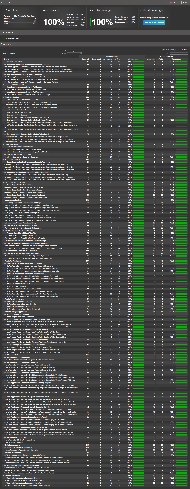
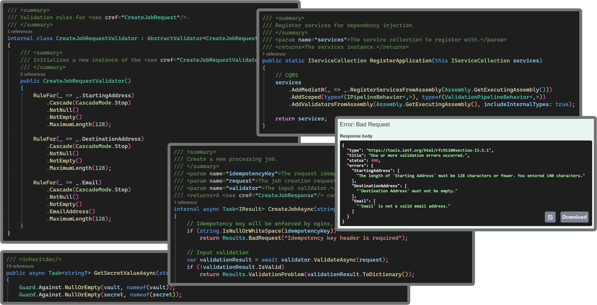
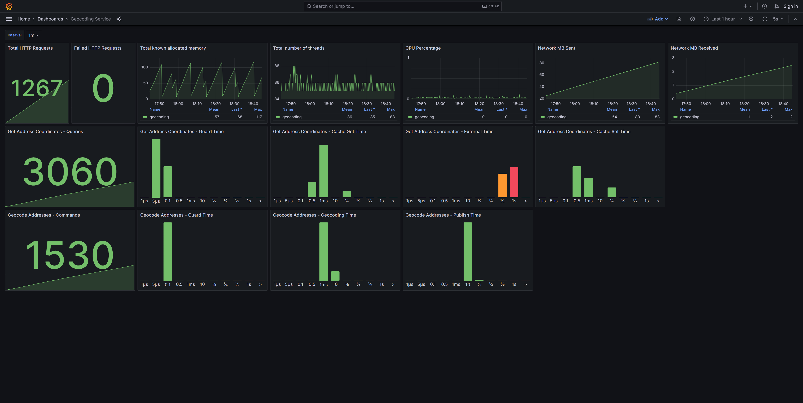
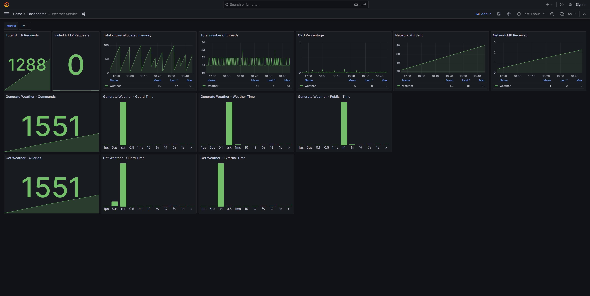
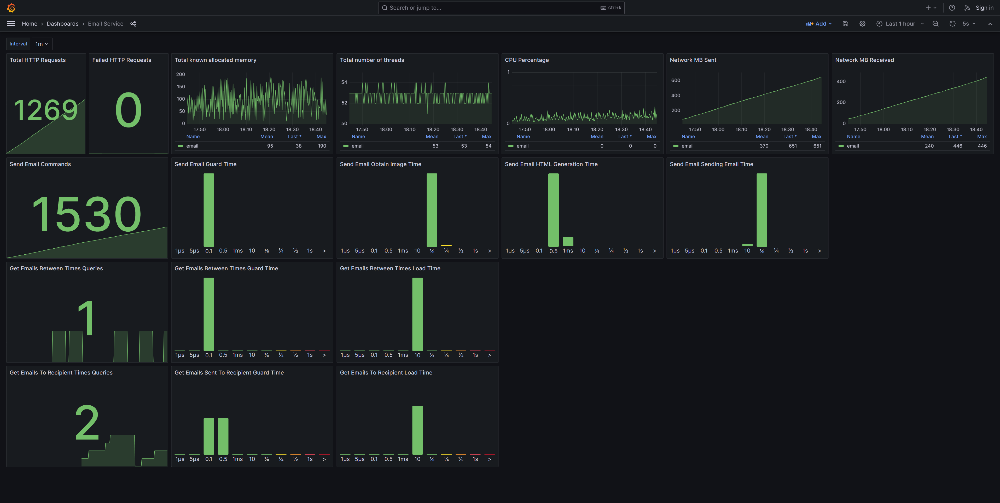

## Application Images

*  Email Report
*  Code Coverage
*  Infrastructure
*  Services
*  Validation

## Metrics

*  RabbitMQ
*  Public API
*  State
*  Directions
*  Geocoding
*  Imaging
*  Weather
*  Email
